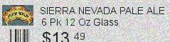
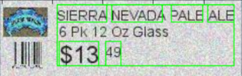

# Problem Statement

How to gather insights on mislabelling of product and price compliance in stores across the globe ?

# Insights gathered/ Final results:

* The price tag of Brooklyn Indian Pale Ale and Brooklyn Oktoberfest were detected as interchanged in 9 different weeks
* The price tag of Bud Light and Bud Light Platinum were detected as interchanged in 4 different weeks
* With no mislabel Magic hat beer had maximum price mismatches


```python
from ipywidgets import interact, interactive, fixed, widgets
from IPython.display import Image
import extract_template_matching
import matplotlib.pyplot as plt2
import cv2

import getting_ocr
import extract_max_contours
%matplotlib inline 
```


```python
template_keys = ['Becks','BROOKLYN PILSNER','COORS LIGHT','LEFFE BLONDE','  MILLER LITE_6 Pk 12 Oz Glass','BLUE POINT TOASTED','BUD LIGHT','','','CORONA EXTRA','MAGIC HAT','SIERRA NEVADA PALE ALE','BROOKLYN INDIA PALE','BUD LIGHT PLATINUM','CORONA LIGHT','MILLER LITE_12 Pk 12 Oz Can','SIERRA NEVADA TORPEDO','BROOKLYN OKTOBERFEST','BUDWEISER','HOEGAARDEN','MILLER LITE_12 Pk 12 Oz Glass','TELLA ARTOIS']
sample_image = 'base_image.jpg'
loc = None
```

# What was given??


```python
Image(filename=sample_image, width=800,height=100)
```


# Challenge

* Extracting the products in the shelf
* Extracting the information from the price tag 

## Extracting the products from the shelf
* Template Matching with Contour Detection
* Features matching  using deep net model, Inception (Scalable solution)

## Extracting the information from the price tag
* Tessaract OCR model for text extraction
* ReInspect TensorBox model (Deep Net model for price tag detection and extraction)

# Demo


```python
def get_template_match(key='Becks', test_image=sample_image):
    template_image_path = 'sample_data/'+key+'.jpg'
    loc = extract_template_matching.get_template_matching(test_image,template_image_path)
```


```python
interact(get_template_match,key=template_keys,__manual=loc)
```


    <function __main__.get_template_match>


```python
Image(filename='result.png', width=500,height=80)
```


```python
price_tag = 'price_tag.jpg'
extracted_price_tag = 'extracted_price_tag.jpg'
Image(filename=price_tag, width=800,height=100)
```


```python
price_tag = 'extracted_price_tag.jpg'
Image(filename=price_tag, width=600,height=50)
```





```python
price_tag = 'price_tag_annotation.png'
Image(filename=price_tag, width=800,height=100)
```





```python
import warnings
warnings.filterwarnings('ignore')
getting_ocr.get_tag_information([extracted_price_tag])
```

    ('Wrote', 2733, 'bytes to', 'jsons/extracted_price_tag.jpg.json')
    ---------------------------------------------
        Bounding Polygon:
    {u'vertices': [{u'y': 7, u'x': 56}, {u'y': 7, u'x': 231}, {u'y': 58, u'x': 231}, {u'y': 58, u'x': 56}]}
        Text:
    SIERRA NEVADA PALE ALE
    13 49
    


## Next Steps

* Scalable solutions using Deep Learning methods like Inception and Reinspect model


```python

```
